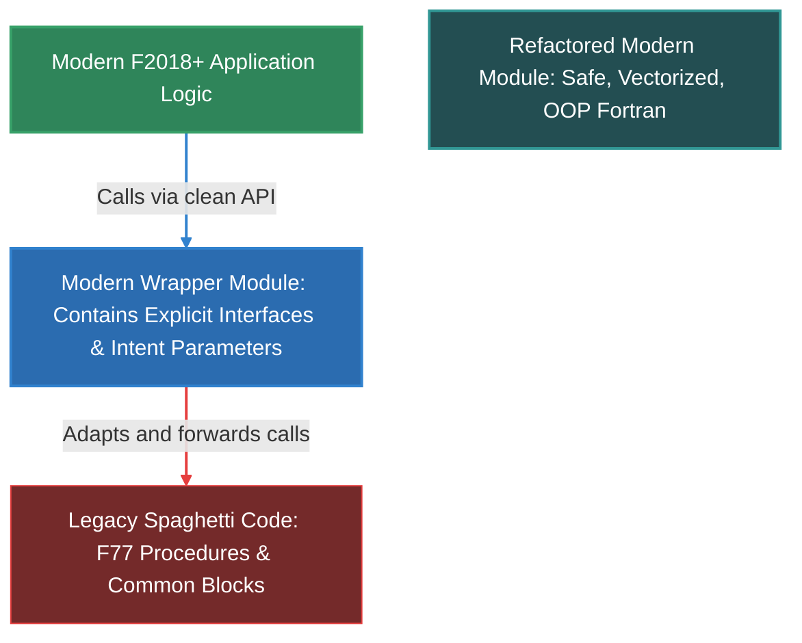

# Modern Fortran Design Patterns & Architecture Reference

This reference guide outlines modern software design patterns and architectural practices for Fortran (F2003/F2018/F2023). It translates standard design patterns (Gang of Four) into idiomatically correct, safe, and performant modern Fortran implementations.

---

## 1. The Modern Fortran Paradigm Shift

Historically, Fortran programs were structured around procedural, monolithic files, implicit typing, and global state (using `common` blocks or `equivalence`). Modern Fortran (F2003 and later) is an entirely different language. It is strongly and statically typed, supports modular encapsulation, handles automated resource cleanup (RAII), and offers a robust object-oriented programming (OOP) model with type extension, polymorphism, and type-bound procedures.

### Summary of Differences: Legacy vs. Modern Fortran

| Aspect | Legacy Fortran (F66, F77, F90) | Modern Fortran (F2003, F2018, F2023) |
| :--- | :--- | :--- |
| **Typing** | Implicit typing (e.g. variables `i-n` are integers, others are reals) | Explicit typing via `implicit none` (enforced at module/program levels) |
| **Global State** | `common` blocks, `equivalence` statements | Modules with controlled visibility (`private`, `public`, `protected`) |
| **Argument Interface** | Implicit interfaces (unsafe parameter types/dimensions) | Explicit interfaces forced by placing subroutines inside modules |
| **Object-Oriented** | None (purely procedural or structured) | Derived types, inheritance (`extends`), and polymorphism (`class(*)`) |
| **Memory Management** | Static arrays or manual pointers; prone to memory leaks | `allocatable` attributes with compiler-managed RAII lifecycles |
| **Compilation** | Monolithic files, complex Makefiles prone to compilation cascades | **Submodules** separating interfaces from procedure implementations |

---

## 2. Creational Patterns in Modern Fortran

### A. Factory Method Pattern
The Factory Method pattern handles object creation by letting subclasses decide which concrete type to instantiate. In modern Fortran, we implement this using an abstract base derived type, extended types, and a factory function that returns a polymorphic pointer or allocatable object (`class(base_t)`).

#### Implementation Example
```fortran
module factory_pattern_mod
  use, intrinsic :: iso_fortran_env, only : dp => real64
  implicit none
  private
  public :: solver_t, direct_solver_t, iterative_solver_t, solver_factory

  ! Abstract Base Class
  type, abstract :: solver_t
  contains
    procedure(solve_interface), deferred :: solve
  end type solver_t

  abstract interface
    subroutine solve_interface(this, x, b)
      import :: solver_t, dp
      class(solver_t), intent(inout) :: this
      real(dp), intent(inout) :: x(:)
      real(dp), intent(in) :: b(:)
    end subroutine solve_interface
  end interface

  ! Concrete implementation: Direct Solver
  type, extends(solver_t) :: direct_solver_t
     real(dp) :: threshold = 1.0e-12_dp
  contains
     procedure :: solve => solve_direct
  end type direct_solver_t

  ! Concrete implementation: Iterative Solver
  type, extends(solver_t) :: iterative_solver_t
     integer :: max_iter = 1000
  contains
     procedure :: solve => solve_iterative
  end type iterative_solver_t

contains

  subroutine solve_direct(this, x, b)
    class(direct_solver_t), intent(inout) :: this
    real(dp), intent(inout) :: x(:)
    real(dp), intent(in)    :: b(:)
    print *, "Solving system using Direct Solver with threshold:", this%threshold
    x = b ! Direct solver implementation stub
  end subroutine solve_direct

  subroutine solve_iterative(this, x, b)
    class(iterative_solver_t), intent(inout) :: this
    real(dp), intent(inout) :: x(:)
    real(dp), intent(in)    :: b(:)
    print *, "Solving system using Iterative Solver with max iterations:", this%max_iter
    x = b * 0.5_dp ! Iterative solver implementation stub
  end subroutine solve_iterative

  ! Factory Function
  function solver_factory(solver_type) result(solver)
    character(len=*), intent(in) :: solver_type
    class(solver_t), allocatable :: solver

    select case(trim(solver_type))
    case("direct")
       allocate(direct_solver_t :: solver)
    case("iterative")
       allocate(iterative_solver_t :: solver)
    case default
       print *, "Unknown solver type: ", solver_type
       error stop
    end select
  end function solver_factory

end module factory_pattern_mod
```

### B. Singleton Pattern
Fortran modules have static storage duration, meaning module-level variables are instantiated once and persist for the lifetime of the program. We can implement the Singleton pattern by declaring a private instance of a derived type inside a module and providing public accessor functions.

#### Implementation Example
```fortran
module logger_singleton_mod
  implicit none
  private
  public :: get_logger, log_message

  type :: logger_t
     private
     integer :: log_unit = -1
     character(len=256) :: file_path = "app.log"
  end type logger_t

  ! The static module variable represents our Singleton state
  type(logger_t), save :: instance
  logical, save :: is_initialized = .false.

contains

  ! Private initializer
  subroutine init_logger()
     if (.not. is_initialized) then
        open(newunit=instance%log_unit, file=instance%file_path, &
             status="replace", action="write")
        is_initialized = .true.
     end if
  end subroutine init_logger

  ! Public function to trigger log output
  subroutine log_message(msg)
     character(len=*), intent(in) :: msg
     if (.not. is_initialized) call init_logger()
     write(instance%log_unit, '(A)') msg
     flush(instance%log_unit)
  end subroutine log_message

  ! Public destructor / cleanup
  subroutine get_logger()
     ! Returns logger status or references if needed
  end subroutine get_logger

end module logger_singleton_mod
```

---

## 3. Structural Patterns in Modern Fortran

### A. Adapter (Wrapper) Pattern
In Fortran, this pattern is frequently used to wrap legacy C functions or legacy Fortran 77 procedures (which use unsafe pointers or global parameters) inside a clean, object-oriented derived type.

#### Implementation Example (Wrapping C pointer functions)
```fortran
module matrix_adapter_mod
  use, intrinsic :: iso_c_binding
  implicit none
  private
  public :: matrix_t

  ! Interface declaration block for C functions
  interface
     function c_malloc(bytes) result(ptr) bind(c, name="malloc")
       import :: c_size_t, c_ptr
       integer(c_size_t), value :: bytes
       type(c_ptr) :: ptr
     end function c_malloc

     subroutine c_free(ptr) bind(c, name="free")
       import :: c_ptr
       type(c_ptr), value :: ptr
     end subroutine c_free
  end interface

  ! Modern Fortran Adapter Class
  type :: matrix_t
     private
     type(c_ptr) :: raw_data_ptr = c_null_ptr
     integer :: rows = 0
     integer :: cols = 0
  contains
     procedure :: initialize => init_matrix
     procedure :: finalize => free_matrix
  end type matrix_t

contains

  subroutine init_matrix(this, r, c)
     class(matrix_t), intent(inout) :: this
     integer, intent(in) :: r, c
     integer(c_size_t) :: bytes
     
     this%rows = r
     this%cols = c
     bytes = int(r, c_size_t) * int(c, c_size_t) * 8_c_size_t
     this%raw_data_ptr = c_malloc(bytes)
  end subroutine init_matrix

  subroutine free_matrix(this)
     class(matrix_t), intent(inout) :: this
     if (c_associated(this%raw_data_ptr)) then
        call c_free(this%raw_data_ptr)
        this%raw_data_ptr = c_null_ptr
     end if
     this%rows = 0
     this%cols = 0
  end subroutine free_matrix

end module matrix_adapter_mod
```

### B. Composite Pattern
The Composite pattern is used to treat individual objects and compositions of objects uniformly. Fortran supports recursive derived types by utilizing `allocatable` or `pointer` attributes for children elements of the same type.

#### Implementation Example
```fortran
module composite_node_mod
  implicit none
  private
  public :: node_t

  type :: node_t
     character(len=50) :: name
     ! Child pointers allow structuring tree hierarchies
     type(node_t), allocatable :: child_nodes(:)
  contains
     procedure :: print_hierarchy
  end type node_t

contains

  recursive subroutine print_hierarchy(this, depth)
     class(node_t), intent(in) :: this
     integer, intent(in) :: depth
     integer :: i
     
     ! Indented printing
     do i = 1, depth
        write(*, '(A)', advance='no') "  "
     end do
     print *, "Node: ", trim(this%name)
     
     if (allocated(this%child_nodes)) then
        do i = 1, size(this%child_nodes)
           call this%child_nodes(i)%print_hierarchy(depth + 1)
        end do
     end if
  end subroutine print_hierarchy

end module composite_node_mod
```

---

## 4. Behavioral Patterns in Modern Fortran

### A. Strategy Pattern (Pluggable Solvers)
Numerical scientific codes require changing solver types or physical algorithms dynamically. We implement the Strategy pattern using **abstract interfaces** and **procedure pointers**.

#### Implementation Example
```fortran
module strategy_integrator_mod
  use, intrinsic :: iso_fortran_env, only : dp => real64
  implicit none
  private
  public :: function_interface, integrator_t, midpoint_rule, trapezoid_rule

  ! Define signature for the pluggable math function
  abstract interface
     function function_interface(x) result(y)
        import :: dp
        real(dp), intent(in) :: x
        real(dp) :: y
     end function function_interface
  end interface

  ! Define signature for pluggable integration strategy
  abstract interface
     function strategy_interface(func, a, b, n) result(integral)
        import :: dp, function_interface
        procedure(function_interface) :: func
        real(dp), intent(in) :: a, b
        integer, intent(in) :: n
        real(dp) :: integral
     end function strategy_interface
  end interface

  ! Strategy Context
  type :: integrator_t
     ! Pluggable procedure pointer
     procedure(strategy_interface), pointer, nopass :: strategy => null()
  contains
     procedure :: integrate
  end type integrator_t

contains

  function integrate(this, func, a, b, n) result(res)
     class(integrator_t), intent(in) :: this
     procedure(function_interface) :: func
     real(dp), intent(in) :: a, b
     integer, intent(in) :: n
     real(dp) :: res

     if (.not. associated(this%strategy)) then
        print *, "Error: Integration strategy has not been set."
        error stop
     end if

     res = this%strategy(func, a, b, n)
  end function integrate

  ! Concrete Strategy A: Midpoint integration
  function midpoint_rule(func, a, b, n) result(integral)
     procedure(function_interface) :: func
     real(dp), intent(in) :: a, b
     integer, intent(in) :: n
     real(dp) :: integral
     real(dp) :: h, x
     integer :: i

     h = (b - a) / n
     integral = 0.0_dp
     do i = 1, n
        x = a + (i - 0.5_dp) * h
        integral = integral + func(x)
     end do
     integral = integral * h
  end function midpoint_rule

  ! Concrete Strategy B: Trapezoid integration
  function trapezoid_rule(func, a, b, n) result(integral)
     procedure(function_interface) :: func
     real(dp), intent(in) :: a, b
     integer, intent(in) :: n
     real(dp) :: integral
     real(dp) :: h
     integer :: i

     h = (b - a) / n
     integral = 0.5_dp * (func(a) + func(b))
     do i = 1, n - 1
        integral = integral + func(a + i * h)
     end do
     integral = integral * h
  end function trapezoid_rule

end module strategy_integrator_mod
```

---

## 5. HPC & Performance-Specific Patterns

### A. Elemental Procedures
Scientific programs regularly need to apply a mathematical or state transform across both single scalars and arrays of arbitrary shape (vectors, 2D grids, 3D volumes). Rather than overloading multiple versions of a procedure, Fortran provides the `elemental` keyword.

#### Implementation Example
```fortran
module physics_formulas_mod
  use, intrinsic :: iso_fortran_env, only : dp => real64
  implicit none
  private
  public :: relativistic_kinetic_energy

contains

  ! Elemental functions are implicitly PURE, meaning they cannot have side effects.
  ! This allows the compiler to vectorize operations or run them concurrently.
  elemental function relativistic_kinetic_energy(mass, velocity) result(ke)
     real(dp), intent(in) :: mass
     real(dp), intent(in) :: velocity
     real(dp) :: ke

     real(dp), parameter :: c = 299792458.0_dp ! Speed of light (m/s)
     real(dp) :: gamma

     gamma = 1.0_dp / sqrt(1.0_dp - (velocity / c)**2)
     ke = (gamma - 1.0_dp) * mass * c**2
  end function relativistic_kinetic_energy

end module physics_formulas_mod
```

### B. Compilation Isolation (Submodules Pattern)
In large Fortran codebases, traditional modules compile to a `.mod` interface descriptor file. If a developer changes a procedure's implementation, the `.mod` file timestamps update, causing a **compilation cascade** that forces everything dependent on that module to recompile.

Fortran 2008 introduced **submodules** to solve this. Declaring interfaces in parent modules and putting implementations in submodules prevents compilation cascades.

#### Implementation Example
```fortran
! --- File: solver_mod.f90 (Parent Module Interface) ---
module solver_interface_mod
  use, intrinsic :: iso_fortran_env, only : dp => real64
  implicit none
  private
  public :: custom_solver

  ! Declare interface. Implementation is deferred to a submodule
  interface
     module subroutine custom_solver(A, x, b)
        real(dp), intent(in) :: A(:,:)
        real(dp), intent(out) :: x(:)
        real(dp), intent(in) :: b(:)
     end subroutine custom_solver
  end interface
end module solver_interface_mod

! --- File: solver_implementation_sub.f90 (Submodule Implementation) ---
submodule (solver_interface_mod) solver_implementation_sub
contains
  ! The submodule has automatic access to parent scope entities
  module subroutine custom_solver(A, x, b)
     real(dp), intent(in) :: A(:,:)
     real(dp), intent(out) :: x(:)
     real(dp), intent(in) :: b(:)

     ! Change this implementation freely; dependents of solver_interface_mod
     ! DO NOT need to be recompiled!
     x = b
  end subroutine custom_solver
end submodule solver_implementation_sub
```

### C. Resource Acquisition Is Initialization (RAII) & Destructors
Fortran cleans up standard `allocatable` structures when they leave scope. For structures carrying external files, sockets, or custom pointer handles, we use the F2003 `final` attribute to define a finalizer (destructor).

#### Implementation Example
```fortran
module file_buffer_mod
  implicit none
  private
  public :: buffer_t

  type :: buffer_t
     private
     integer :: unit = -1
     character(len=256) :: filename = ""
  contains
     procedure :: open_file
     ! Define standard destructor binding
     final :: finalize_buffer
  end type buffer_t

contains

  subroutine open_file(this, path)
     class(buffer_t), intent(inout) :: this
     character(len=*), intent(in) :: path
     this%filename = path
     open(newunit=this%unit, file=trim(path), status="unknown", position="append")
  end subroutine open_file

  ! Automatic finalizer triggered when buffer_t variable goes out of scope
  subroutine finalize_buffer(this)
     type(buffer_t), intent(inout) :: this
     if (this%unit /= -1) then
        print *, "Closing allocated file handle: ", trim(this%filename)
        close(this%unit)
        this%unit = -1
     end if
  end subroutine finalize_buffer

end module file_buffer_mod
```

---

## 6. Multi-Generational Legacy Systems & Incremental Modernization

Large-scale Fortran applications in scientific computing and engineering have often been in continuous development for decades. They contain layers of code written by different generations of programmers, using varying standards (F66, F77, F90, F95, F2003, F2008, F2018) and diverse vendor-specific compilers. 

### A. Challenges of Multi-Decade Codebase Drift
When refactoring or extending multi-generational codebases, developers face several challenges:
1. **Dialect and Extension Drift:** Code written for compilers from the 1980s or 1990s (like VAX Fortran, DEC Fortran, Cray CF90, or IBM VS Fortran) often contains non-standard language extensions. Examples include DEC structure blocks, non-standard system calls, tab-indentation formatting, or Hollerith constants.
2. **Compiler Flag Dependencies:** The application may require a convoluted chain of compiler flags to build, such as `-fdec`, `-std=legacy`, `-ffixed-line-length-132`, or `-axCORE-AVX512`. This hides underlying standard compliance bugs.
3. **Mixed-Source Formats:** Within the same project, you may have fixed-format source files (`.f`, `.for`) mixing with modern free-format files (`.f90`, `.f08`). 
4. **Missing Compilation Boundaries:** The code may rely on global implicit interfaces, meaning a change in a common block in one file silently corrupts memory in another file without compile-time errors.

### B. Safe Refactoring Strategy (Incremental Modernization)
Rewriting decades-old codes from scratch is high-risk. Instead, adopt the **Strangler Fig Pattern** to incrementally wrap, modularize, and modernize the system:



#### Step 1: Establish a Regression Test Suite
Before changing any code, establish unit and integration test runs (using `fpm`, `make`, or standard regression scripts). Capture standard output and binary file checksums of calculation results to guarantee that modernization steps do not alter physical results.

#### Step 2: Sandbox the Legacy Code (The Wrapper Module)
Keep the legacy `.f` files untouched initially. Isolate them by writing a modern module containing **explicit interface blocks** for the legacy subroutines. Add variable typing rules and parameter intents in the interface block, forcing the modern compiler to check arguments at compile time.

#### Step 3: Decouple Vendor-Specific Dialects
If the code relies on non-standard DEC structures, convert them to standard Fortran derived types. Replace VAX-style file statements (like `readonly` or `shared` in `open` calls) with standard-compliant syntax or isolate them inside system-dependent utility modules.

#### Step 4: Convert File Formats and Replace Constructs One-by-One
Once the interfaces are secure, convert fixed-format files to free-format `.f90` using conversion scripts (like `fconvert` or `fprettify`), add `implicit none`, and systematically replace legacy constructs according to the checklist below.

---

### C. Expanded Diagnostic Table for Code Reviews & Mixed Standards

Use this comprehensive checklist when reviewing pull requests or auditing multi-generational systems to guide legacy refactoring:

| Legacy Pattern Detected | Why It's Harmful | Refactoring Target Solution |
| :--- | :--- | :--- |
| **Missing `implicit none`** | Uncaught typos automatically compile as new implicit variables, causing silent arithmetic bugs. | Add `implicit none` to the beginning of all modules, submodules, and programs. |
| **`real*8` or `integer*4`** | Non-standard vendor extensions. Can break on different compilers or platforms. | Use `real(kind=dp)` or `real(real64)` imported from the intrinsic module `iso_fortran_env`. |
| **`double precision`** | Standard but legacy. Cannot be parameterized dynamically. | Parameterize real declarations using standard named KIND constants. |
| **Cray Pointers (`pointer(p, x)`)** | Non-standard syntax that links integer addresses directly to variable structures, bypassing safety controls. | Replace with standard Fortran pointers (`type, pointer :: x`) or modern `allocatable` parameters. |
| **Hollerith Constants (`10HMYSTRING`)** | Obsolete F66/F77 notation storing text characters inside numeric variables. | Replace with standard character variables and character string literals (e.g. `"MYSTRING"`). |
| **DEC Structure Blocks (`structure / union`)** | Vendor-specific dialect extension that is highly unportable. | Refactor structure blocks into modern standard Fortran nested `derived type` structures. |
| **Common Blocks (`common /myblock/ a, b`)** | Global state blocks with no encapsulation. Prone to alignment errors and data corruption. | Move global state variables into a module. Mark variables `private` and provide accessors. |
| **`equivalence` statement** | Directs compiler to share the same physical memory space across different variables. Unsafe for compilers. | Replace with standard pointers, or use the standard intrinsic function `transfer` for type casting. |
| **Numbered DO loops & GOTO** | Leads to unstructured spaghetti code that is difficult to trace or optimize. | Replace with structured loops (`do ... end do`), and use `cycle` and `exit` for jumps. |
| **Arithmetic IF (`if (x) 10, 20, 30`)** | Obsolescent jump structure based on conditional numeric signs. | Replace with standard logical block structures (`if / else if / else / end if`). |
| **Missing `intent` declarations** | Dummy arguments without intents prevent compile-time checking of read/write access. | Ensure every argument declares `intent(in)`, `intent(out)`, or `intent(inout)`. |
| **Standalone `external` procedures** | Compiler cannot check argument mismatches between calls, causing bugs at run time. | Encapsulate procedures inside module `contains` blocks, or write explicit `interface` blocks. |
| **Unmanaged array allocation** | Dynamic allocations can run out of memory silently, crashing without diagnostic errors. | Add `stat=status` and `errmsg=msg` variables to all `allocate` and `deallocate` statements. |

---

## 7. The Object Sorting Problem in Fortran

Unlike modern languages like C++ (`std::sort`), Python (`list.sort()`), or Rust (`slice::sort`), **Fortran has no standard library sorting utilities**. Developers must implement sorting algorithms manually or call external libraries.

### A. Workload-Aware Sorting: Choosing the Right Approach
When designing sorting algorithms for Fortran, evaluate the dataset size, data structure overhead, and memory constraints:

1. **Workload Analysis & Performance Tradeoffs:**
   - **Quicksort:** Best general-purpose algorithm for primitive numeric arrays. It operates in-place, has excellent cache locality, and is highly optimized by compilers. However, it is unstable and has a worst-case performance of $O(n^2)$ on structured pivots.
   - **Mergesort:** Stable sorting algorithm with a guaranteed $O(n \log n)$ performance. Essential when maintaining the relative order of identical records (e.g. sorting by timestamp first, then by ID). However, it requires $O(n)$ auxiliary workspace memory.
   - **Heapsort:** Guaranteed $O(n \log n)$ in-place sort, but has poor cache locality because memory accesses jump non-contiguously across tree nodes.
   - **Insertion Sort:** $O(n^2)$ worst-case, but extremely fast for very small lists ($n < 32$) or datasets that are already nearly sorted. Often used as a fallback optimization inside hybrid sorts (like Timsort or IntroSort).

2. **The Bottleneck of Object Movement (Deep Copies):**
   Sorting lists of complex `derived types` (objects containing strings, arrays, or pointers) directly is highly inefficient in Fortran. Performing a swap operation:
   ```fortran
   temp = array(i)
   array(i) = array(j)
   array(j) = temp
   ```
   triggers a **deep copy** of every field in the derived type, including allocations. This generates huge memory transfer overhead.

3. **The High-Performance Solution: Indirect (Index) Sorting:**
   Instead of moving the heavy objects in memory, sort a simple integer index array `indices = [1, 2, ..., n]`. The comparison operations dereference the original objects through the indices, but the swaps only move the integers:
   ```fortran
   ! Swapping lightweight index values instead of massive objects
   temp_idx = indices(i)
   indices(i) = indices(j)
   indices(j) = temp_idx
   ```
   After sorting, access elements indirectly via `array(indices(i))` or permute the original array in place in a single $O(n)$ pass.

---

### B. Generic Object Sorting using Polymorphic Interfaces
To write a reusable, type-safe sorting algorithm without duplicating code for every unique type, implement an **abstract interface** (`comparable_t`) using F2003 OOP features.

```fortran
module generic_sort_mod
  implicit none
  private
  public :: comparable_t, index_mergesort

  ! Abstract base class requiring children to implement comparison
  type, abstract :: comparable_t
  contains
     procedure(is_less_interface), deferred :: is_less
  end type comparable_t

  abstract interface
     function is_less_interface(this, other) result(res)
        import :: comparable_t
        class(comparable_t), intent(in) :: this
        class(comparable_t), intent(in) :: other
        logical :: res
     end function is_less_interface
  end interface

contains

  ! Performs a stable index mergesort on polymorphic objects
  subroutine index_mergesort(items, indices)
     class(comparable_t), intent(in) :: items(:)
     integer, intent(inout) :: indices(:)

     integer :: n, i
     integer, allocatable :: temp_indices(:)

     n = size(items)
     if (size(indices) /= n) then
        print *, "Error: Index array size mismatch."
        error stop
     end if

     ! Initialize index list
     do i = 1, n
        indices(i) = i
     end do

     allocate(temp_indices(n))
     call mergesort_split(items, indices, temp_indices, 1, n)
  end subroutine index_mergesort

  ! Recursive mergesort helper
  recursive subroutine mergesort_split(items, indices, temp, left, right)
     class(comparable_t), intent(in) :: items(:)
     integer, intent(inout) :: indices(:)
     integer, intent(inout) :: temp(:)
     integer, intent(in) :: left, right
     integer :: mid

     if (left < right) then
        mid = left + (right - left) / 2
        call mergesort_split(items, indices, temp, left, mid)
        call mergesort_split(items, indices, temp, mid + 1, right)
        call mergesort_merge(items, indices, temp, left, mid, right)
     end if
  end subroutine mergesort_split

  ! Merges two sorted index subsets
  subroutine mergesort_merge(items, indices, temp, left, mid, right)
     class(comparable_t), intent(in) :: items(:)
     integer, intent(inout) :: indices(:)
     integer, intent(inout) :: temp(:)
     integer, intent(in) :: left, mid, right

     integer :: i, j, k

     i = left
     j = mid + 1
     k = left

     do while (i <= mid .and. j <= right)
        ! Compare items indirectly through indices
        if (items(indices(i))%is_less(items(indices(j)))) then
           temp(k) = indices(i)
           i = i + 1
        else
           temp(k) = indices(j)
           j = j + 1
        end if
        k = k + 1
     end do

     do while (i <= mid)
        temp(k) = indices(i)
        i = i + 1
        k = k + 1
     end do

     do while (j <= right)
        temp(k) = indices(j)
        j = j + 1
        k = k + 1
     end do

     indices(left:right) = temp(left:right)
  end subroutine mergesort_merge

end module generic_sort_mod
```

#### How to Extend and Use the Polymorphic Sort:
```fortran
module user_records_mod
  use generic_sort_mod
  implicit none
  private
  public :: employee_t

  ! Extend comparable_t to define record sorting
  type, extends(comparable_t) :: employee_t
     character(len=30) :: name
     integer :: id_number
     real :: performance_score
  contains
     procedure :: is_less => compare_employees
  end type employee_t

contains

  ! Sort primarily by score (descending), secondary by ID (ascending)
  function compare_employees(this, other) result(res)
     class(employee_t), intent(in) :: this
     class(comparable_t), intent(in) :: other
     logical :: res

     select type(other)
     type is (employee_t)
        if (this%performance_score /= other%performance_score) then
           res = this%performance_score > other%performance_score
        else
           res = this%id_number < other%id_number
        end if
     class default
        print *, "Error: Incompatible comparison types."
        error stop
     end select
  end function compare_employees
end module user_records_mod
```

---

### C. Callback-Based Indirect Sorting (C-style Function Pointer Sort)
If you prefer procedural abstraction without object-oriented class hierarchies, use **procedure pointers** as sorting callbacks. This allows passing custom logical comparison functions directly to the sorter.

```fortran
module callback_sort_mod
  implicit none
  private
  public :: index_quicksort, compare_callback_interface

  ! Abstract interface for the comparison callback
  abstract interface
     function compare_callback_interface(i, j) result(res)
        integer, intent(in) :: i, j
        logical :: res
     end function compare_callback_interface
  end interface

contains

  ! In-place Quicksort on indices using a pluggable comparison callback
  subroutine index_quicksort(n, indices, compare)
     integer, intent(in) :: n
     integer, intent(inout) :: indices(:)
     procedure(compare_callback_interface) :: compare

     integer :: i
     
     if (size(indices) < n) then
        print *, "Error: Index array too small."
        error stop
     end if

     do i = 1, n
        indices(i) = i
     end do

     if (n > 1) call qsort_helper(indices, compare, 1, n)
  end subroutine index_quicksort

  ! Recursive quicksort helper
  recursive subroutine qsort_helper(indices, compare, left, right)
     integer, intent(inout) :: indices(:)
     procedure(compare_callback_interface) :: compare
     integer, intent(in) :: left, right
     integer :: pivot_idx, partition_idx

     if (left < right) then
        call partition(indices, compare, left, right, partition_idx)
        call qsort_helper(indices, compare, left, partition_idx - 1)
        call qsort_helper(indices, compare, partition_idx + 1, right)
     end if
  end subroutine qsort_helper

  ! Partitions the array around a pivot
  subroutine partition(indices, compare, left, right, partition_idx)
     integer, intent(inout) :: indices(:)
     procedure(compare_callback_interface) :: compare
     integer, intent(in) :: left, right
     integer, intent(out) :: partition_idx

     integer :: pivot, i, j, temp

     pivot = indices(right)
     i = left - 1

     do j = left, right - 1
        ! Use comparison callback (checking index values)
        if (compare(indices(j), pivot)) then
           i = i + 1
           temp = indices(i)
           indices(i) = indices(j)
           indices(j) = temp
        end if
     end do

     i = i + 1
     temp = indices(i)
     indices(i) = indices(right)
     indices(right) = temp
     partition_idx = i
  end subroutine partition

end module callback_sort_mod
```

