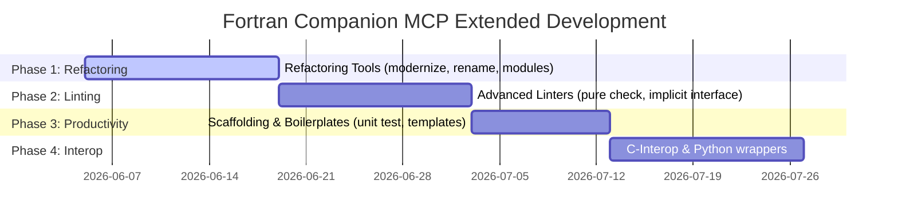

# Fortran Companion MCP Server: Extended Capabilities Implementation Plan

This implementation plan outlines the roadmap and technical specifications for expanding the **Fortran Companion** MCP server with automated refactoring, advanced linting, test scaffolding, and language interoperability bindings.

---

## 🗺️ Roadmap & Phases

We organize the implementation of these tools into four sequential phases, progressing from basic syntax transformation to complex cross-language integration.



---

## Phase 1: Automated F77-to-F2018 Refactoring

These tools automate tedious manual transformations of legacy code syntax.

### 1. Identifier Expansion Tool
*   **MCP Tool Name:** `rename_legacy_identifiers`
*   **API Specification:**
    ```python
    @mcp.tool()
    def rename_legacy_identifiers(file_path: str, mapping: dict) -> str:
        """Safely renames legacy variables to descriptive modern names across a file scope."""
    ```
*   **Behavior:**
    1. Parse the scoping units of the target file using `FortranLinter`.
    2. Validate that the mapping does not introduce duplicate variable names within any active scope.
    3. Update the variable declarations and all matched code statement occurrences.
    4. Auto-run `fprettify` and run compilation to verify syntax validity.

### 2. Common Block to Module Converter
*   **MCP Tool Name:** `convert_common_to_module`
*   **API Specification:**
    ```python
    @mcp.tool()
    def convert_common_to_module(file_path: str, block_name: str, module_name: str) -> str:
        """Extracts a legacy COMMON block and generates an encapsulated module."""
    ```
*   **Behavior:**
    1. Scan the file for the target common block definition: `common /block_name/ var1, var2...`
    2. Extract the variables and map their local types (by inspecting matching declaration lines).
    3. Create a new modern module file: `module_name.f90` pre-configured with `implicit none` and explicit kinds.
    4. Comment out the legacy common block in the source file and insert `use module_name, only : ...` imports.

---

## Phase 2: Advanced HPC & Optimization Linters

These tools analyze source code structures to detect safety risks and suggest optimizations.

### 1. Candidate PURE Procedures Analyzer
*   **MCP Tool Name:** `analyze_pure_candidates`
*   **API Specification:**
    ```python
    @mcp.tool()
    def analyze_pure_candidates(file_path: str) -> str:
        """Scans procedures in a file and identifies subprograms suitable for 'pure' or 'elemental' attributes."""
    ```
*   **Behavior:**
    1. Scan procedures for any of the following side effects:
        *   Modifying global state / module variables.
        *   Performing I/O operations (`write`, `print`, `read`, `open`, `close`).
        *   Having dummy arguments without `intent(in)` (or returning variables in subroutines without intents).
        *   Using non-pure external procedures.
    2. If zero violations are found, print a recommendation to prepend `pure` or `elemental`.

### 2. Implicit Interface Auditor
*   **MCP Tool Name:** `audit_implicit_interfaces`
*   **API Specification:**
    ```python
    @mcp.tool()
    def audit_implicit_interfaces(project_path: str) -> str:
        """Audits the project and lists all subroutine calls lacking an explicit interface."""
    ```
*   **Behavior:**
    1. Analyze all files to extract declared modules and their public subprograms.
    2. Check all call sites (`call my_subroutine(...)`).
    3. If the subroutine is defined as an `external` procedure without a wrapper module or an explicit local `interface` block, flag it as a safety violation.

---

## Phase 3: Developer Productivity & Test Scaffolding

These tools automate standard scaffolding to increase developer velocity.

### 1. Test Suite Scaffolder
*   **MCP Tool Name:** `scaffold_unit_test`
*   **API Specification:**
    ```python
    @mcp.tool()
    def scaffold_unit_test(file_path: str, procedure_name: str, framework: str = "standard") -> str:
        """Generates unit testing templates for a specific module procedure."""
    ```
*   **Behavior:**
    1. Parse the module and locate the target procedure interface.
    2. Inspect dummy arguments to determine types, dimensions, and intents.
    3. Auto-generate a test file (e.g. `test_procedure.f90`) declaring stub inputs, calling the procedure, and verifying output conditions using standard assertions.
    4. Register the new test routine inside the project's Makefile or `fpm.toml`.

### 2. HPC Skeleton Generator
*   **MCP Tool Name:** `scaffold_hpc_grid`
*   **API Specification:**
    ```python
    @mcp.tool()
    def scaffold_hpc_grid(project_path: str, grid_name: str, dimensions: int) -> str:
        """Bootstraps a modern HPC template for grid/stencil calculations using Coarrays or OpenMP."""
    ```
*   **Behavior:**
    1. Create modular scaffolding containing grid derived types.
    2. Add standard bounds check, ghost cell swap, and parallel iteration loops.
    3. Expose parameters configured with OpenMP loop directives (`!$omp parallel do`) or standard F2008 Coarray configurations.

---

## Phase 4: Interoperability Binding Generators

These tools wrap modern Fortran calculations inside C/C++ engines and Python scripts.

### 1. C-Interop Wrapper Generator
*   **MCP Tool Name:** `generate_c_bindings`
*   **API Specification:**
    ```python
    @mcp.tool()
    def generate_c_bindings(file_path: str, module_name: str) -> str:
        """Auto-generates a standard C binding layer module for a modern Fortran module."""
    ```
*   **Behavior:**
    1. Parse the public procedures and derived types in the Fortran module.
    2. Generate a companion module `module_name_c_mod.f90` that maps Fortran types to C-compatible types using `iso_c_binding`.
    3. Expose binding functions using `bind(c, name="...")` flags to ensure clean, demangled linker symbols.

### 2. Python interface wrapper
*   **MCP Tool Name:** `generate_python_interface`
*   **API Specification:**
    ```python
    @mcp.tool()
    def generate_python_interface(file_path: str, module_name: str) -> str:
        """Auto-generates ctypes/numpy binding wrapper scripts for Python integration."""
    ```
*   **Behavior:**
    1. Generate C-bindings layer via `generate_c_bindings`.
    2. Write a Python script `module_name.py` that utilizes `ctypes` to load the compiled shared library (`.so`/`.dylib`/`.dll`), map Python numeric lists/NumPy arrays to C pointers, and execute calculations seamlessly.

---

## 📋 Summary of Development Deliverables

| Phase | Tool Name | Scope | Expected Impact |
| :--- | :--- | :--- | :--- |
| **Phase 1** | `rename_legacy_identifiers` | AST / text | Replaces cryptic 6-char labels with legible names. |
| **Phase 1** | `convert_common_to_module` | Structural | Eliminates unsafe COMMON blocks in favor of module variables. |
| **Phase 2** | `analyze_pure_candidates` | Static Analysis | Promotes vectorization and parallel code safety in loops. |
| **Phase 2** | `audit_implicit_interfaces` | Static Analysis | Prevents runtime memory crashes by catching untyped subroutine calls. |
| **Phase 3** | `scaffold_unit_test` | Code Generation | Speeds up test writing by generating boilerplate assertions. |
| **Phase 3** | `scaffold_hpc_grid` | Code Generation | Restructures mesh solvers with parallel loop primitives. |
| **Phase 4** | `generate_c_bindings` | Interop | Standardizes standard C/C++ binding linkages. |
| **Phase 4** | `generate_python_interface` | Interop | Generates native numpy-ctypes bridges for Python workflows. |
